# ctxman — Context Management Service

**Spezifikation v0.2 (Draft)**
Status: Entwurf zur Diskussion · Datum: 2026-06-11 · Implementierungssprache: C# (.NET)

---

## 1. Zweck und Abgrenzung

ctxman ist ein eigenständiger, wiederverwendbarer Stateful-Service, der den LLM-Context von Agents als first-class Ressource verwaltet. Er beantwortet genau eine Frage: **"Was sieht das Modell in diesem Turn?"** Er hat keine harten Abhängigkeiten zu anderen Diensten — Authentifizierung, Autorisierung und Secret-Bezug sind Deployment-Konfiguration bzw. Erweiterungspunkte (siehe §4.1 und Anhang A).

Das mentale Modell ist die Speicherverwaltung von Programmen: Der Context besteht aus einer statischen, cache-stabilen Region (Stack-Analogie: System Prompt, Tool-Definitionen) und einem dynamischen Working Set (Heap: Conversation, Tool-Results). Einzelne Working-Segmente (Task, Entscheidungen) können **gepinnt** werden und sind damit für den GC unantastbar — sie bleiben aber an ihrer chronologischen Position. Ein Garbage Collector hält das Working Set unter Budget — über Externalisierung (Pointer statt Werte), Eviction, Compaction und Promotion dauerhafter Fakten in einen Memory-Store.

### 1.1 Architekturentscheidung (Kurzfassung)

Gewählt wurde **Variante A: Context-Store-Service mit dünnem Client-SDK pro Sprache** (Python für pytaskforce, C# für .NET-Anwendungen).

- Der Agent führt den LLM-Hauptcall **selbst** aus. ctxman liefert per `render` das fertige Request-Fragment (System, Tools, Messages) im Format des jeweiligen Provider-Adapters.
- ctxman besitzt die **kanonische Repräsentation** des Contexts (Segmente). Die Message-Liste ist ein Render-Artefakt, nie Source of Truth.
- GC-Operationen, die LLM-Calls benötigen (Compaction, Fact-Promotion), führt ctxman **asynchron im Hintergrund** mit einem eigenen, dafür konfigurierten LLM-Backend aus. Der Hot Path (`append`, `render`) enthält keine LLM-Calls.

Verworfene Alternativen:

- **Variante B (Context-aware LLM-Proxy):** transparent für SDKs, aber Verlust feingranularer Kontrolle (Pinning, Frames), Streaming-Komplexität, Single Point of Failure im Hot Path.
- **Variante C (Spec + native SDKs ohne Service):** kein Netzwerk-Hop, aber doppelte GC-Implementierung in Python und C#, die zwangsläufig divergiert.

### 1.2 Goals

- G1: Wiederverwendbare Context-Verwaltung für beliebige Agents (Python, C#, weitere) über eine REST/JSON-API.
- G2: Token-Budget-Einhaltung durch deterministische Minor Collections und asynchrone, LLM-gestützte Major Collections.
- G3: Byte-stabile Render-Prefixes zur maximalen Ausnutzung von Provider-seitigem Prompt-Caching.
- G4: Pointer-Semantik für große Tool-Results (Externalisierung in Blob Store, Lazy-Expansion per Page-Fault-Tool).
- G5: Frame-Semantik für Subagents (Push/Pop mit Return-Segment).
- G6: Vollständige Auditierbarkeit über einen Event-Stream ("Warum wusste der Agent X in Turn 30 nicht mehr?" muss beantwortbar sein).
- G7: Multi-Tenancy mit Tenant-Isolation auf Datenebene; Policies deklarativ pro Agent-Template konfigurierbar.
- G8: Betrieb mit und ohne Authentifizierung/Autorisierung — vom eingebetteten Single-User-Setup ohne Auth bis zum mandantenfähigen Deployment mit JWT und externem PDP, ohne Code-Änderung (nur Konfiguration).
- G9: **Provider-Agnostik.** ctxman ist an keinen Modell-Anbieter gebunden. Das Domänenmodell kennt keinen Provider; erst Provider-Adapter erzeugen beim `render` das jeweilige Wire-Format (v1: Anthropic, OpenAI; weitere pluggable, siehe §4.6).

### 1.3 Non-Goals

- N1: Kein LLM-Gateway/Proxy. ctxman ruft das Modell des Agents nie auf.
- N2: Keine Cross-Session-Wissensdatenbank. Persistentes Wissen ist Aufgabe des Memory-Stores hinter der Promotion-Schnittstelle; ctxman schreibt dorthin, liest aber nicht.
- N3: Kein dynamisches Relevance-Scoring per LLM pro Segment in v1. Deterministische Heuristiken (TTL, Größe, Recency, Generation) decken den Großteil ab.
- N4: Kein Reordering des gerenderten Layouts zur "Optimierung". Layout-Stabilität schlägt cleveres Umsortieren (Cache, Reproduzierbarkeit).
- N5: Keine Credential-Verwaltung. Secrets (z. B. für das Compaction-LLM-Backend) bezieht ctxman aus der Standard-Konfiguration des Hosts (Env, appsettings, Secret-Provider).

---

## 2. Domänenmodell

### 2.1 Session

Eine Session repräsentiert den Context eines Agent-Laufs.

```
Session
├── id: ULID
├── tenant_id: string            (Pflicht, Isolation auf Zeilenebene)
├── agent_template_id: string?   (referenziert Policy-Konfiguration)
├── policy: PolicyConfig         (aufgelöste, effektive Policy — Snapshot bei Erstellung)
├── context_version: long        (monoton, optimistic concurrency)
├── static_epoch: int            (Version der Static-Region, siehe I1 und §4.2)
├── current_turn: int
├── status: active | archived
├── created_at / updated_at
└── frames: Stack<Frame>
```

### 2.2 Segment

Das atomare Element des Contexts. Die Message-Liste der Provider-API wird ausschließlich aus Segmenten gerendert.

```
Segment
├── id: ULID
├── session_id: ULID
├── region: Static | Working
├── kind: string                 (offenes Vokabular, siehe 2.3)
├── source: string | null        (logische Herkunft, z. B. "core", "skills", "mcp:github" — Basis für Epoch-Diffs)
├── role: system | user | assistant | tool
├── content: string | null       (null ⇔ externalisiert)
├── blob_ref: BlobRef | null     (Pointer in Blob Store)
├── refetchable: bool            (Inhalt aus externer Quelle verlustfrei neu beziehbar)
├── origin: string | null        (Quell-URI bei refetchable, z. B. skill://…, mcp://server/resource)
├── summary: string | null       ("Typ-Signatur" bei Externalisierung; Kurzfassung nach Compaction)
├── tool_call_id: string | null  (Korrelation tool_use ↔ tool_result; Units werden hieraus abgeleitet)
├── frame_id: ULID | null        (null = Root-Frame)
├── pinned: bool                 (für GC unantastbar; rendert an chronologischer Position)
├── created_turn: int
├── last_referenced_turn: int
├── tokens: int                  (gezählt beim Append, Tokenizer konfigurierbar)
├── seq: long                    (globale, stabile Render-Reihenfolge innerhalb der Session)
└── state: live | externalized | compacted | evicted
```

Invarianten:

- I1: Segmente mit `region = Static` sind **innerhalb einer Static-Epoche immutable** (kein Update, keine Eviction, keine Externalisierung, keine Compaction). Änderungen an der Static-Region (z. B. geänderte MCP-Tool-Listen) erfolgen ausschließlich über den Epoch-Bump-Endpunkt (§4.2), der `static_epoch` erhöht und ein `static_epoch_bumped`-Event emittiert — jede Epoche ist eine bewusste, auditierbare Cache-Invalidierung. Direkte Schreibversuche ⇒ `409 Conflict`.
- I2: `content` und `blob_ref` sind nie beide null bei `state = live | externalized`.
- I3: `state = evicted | compacted` Segmente erscheinen nie im Render-Output, bleiben aber für Audit in der DB (soft delete).
- I4: Render-Reihenfolge ist strikt `Static → Working`. Innerhalb von Static gilt kanonische Sortierung nach `(source, kind, content_hash)` — nie Insertion-Order —, damit identische Toolset-Kombinationen byte-identische Prefixes erzeugen (siehe §4.2). Innerhalb von Working gilt `seq` aufsteigend; gepinnte Segmente bleiben an ihrer chronologischen Position (kein Herausziehen in einen separaten Block — das würde Rollen-Alternation und Chronologie brechen und bei jedem nachträglichen Pin den Cache invalidieren). Kein Reordering.
- I5: Eine Unit ist nur dann render-eligible, wenn sie **vollständig** ist (jeder `tool_call` hat sein `tool_result`) — ein gerenderter `tool_use`-Block ohne Result wäre ein Provider-API-Fehler. Daher MUSS das Client-SDK beim Deaktivieren einer Tool-Quelle (z. B. MCP-Server-Disable) alle offenen Calls dieser Quelle mit einem synthetischen Error-`tool_result` ("tool no longer available") schließen, bevor es den Epoch-Bump ausführt. Existiert beim `render` dennoch eine offene Unit, antwortet der Service mit `422` und der Liste der unvollständigen Units.

### 2.3 Segment-Kinds (Startvokabular)

| kind | typische Region | Default-Verhalten |
|---|---|---|
| `system_prompt` | Static | nie anfassen |
| `tool_def` | Static | epoch-gebunden; Herkunft über `source` ("core", "mcp:github", …) — Änderung der Quellen-/Tool-Liste ⇒ Epoch-Bump |
| `skill_index` | Static | epoch-gebunden (Name + Description aller verfügbaren Skills) |
| `skill_content` | Working | **refetchable** (origin = Skill-Quelle); mittlere TTL; Eviction ohne Blob-Write |
| `mcp_resource` | Working | **refetchable** (origin = Resource-URI); kurze TTL |
| `task` | Working, `pinned` | nie evicten, Kandidat für Promotion am Session-Ende |
| `decision` | Working, `pinned` | nie evicten, Promotion-Kandidat |
| `user_msg` | Working | hohe TTL, Compaction in Major Collection |
| `assistant_msg` | Working | hohe TTL, Compaction |
| `tool_call` | Working | gekoppelt an `tool_result` (unit) |
| `tool_result` | Working | kurze TTL, primärer Externalisierungs-Kandidat |
| `subagent_return` | Working | Ergebnis eines Frame-Pop |
| `ref_expansion` | Working | Ergebnis eines Page Faults; sehr kurze TTL |

Das Vokabular ist offen — Policies referenzieren Kinds per Name; unbekannte Kinds erhalten die Working-Defaults.

### 2.4 Logische Einheiten (Units)

Eviction, Externalisierung und Compaction operieren auf **Units**, nie auf Einzel-Segmenten, wenn Segmente gekoppelt sind. Eine Unit ist mindestens: ein `tool_call`-Segment plus sein korrespondierendes `tool_result` (via `tool_call_id`). Damit ist konstruktionsbedingt ausgeschlossen, dass der Render-Output verwaiste `tool_use`-Blöcke ohne `tool_result` enthält (Provider-APIs lehnen das ab).

Regel: Wird das `tool_result` einer Unit externalisiert, bleibt der `tool_call` live und das Result wird durch `summary` + Ref-Hinweis ersetzt. Wird die Unit evicted, verschwinden beide.

### 2.5 Frame

Frames bilden Subagent-Aufrufe als Stack-Frames ab.

```
Frame
├── id: ULID
├── session_id: ULID
├── parent_frame_id: ULID | null
├── label: string                ("research_subtask", …)
├── opened_turn: int
└── status: open | popped
```

Semantik:

- `push`: neue Segmente erhalten die `frame_id` des obersten offenen Frames.
- `render` (Default): rendert nur Segmente des aktuellen Frame-Pfads (Root + offene Frames). Optional `scope=frame` für isolierte Subagent-Sicht (Static + gepinnte Root-Segmente + Segmente des Frames).
- `pop`: alle Segmente des Frames werden `evicted`; der im Pop-Request übergebene Return-Content wird als ein neues Segment `kind=subagent_return` im Parent-Frame angelegt. Vor der Eviction läuft die Promotion-Policy über die Frame-Segmente (Frame-lokale Entscheidungen dürfen nicht verloren gehen).
- Pop-Ordnung: Ein Frame mit offenen Kind-Frames kann nicht gepoppt werden ⇒ `409` — strikte LIFO-Disziplin, Kinder zuerst.

### 2.6 BlobRef

```
BlobRef
├── store: string                (Adapter-Name, z. B. "azure-blob", "fs", "s3")
├── key: string                  (content-addressed: sha256 des Inhalts)
├── size_bytes: long
└── content_type: string
```

Blob-Inhalte sind immutable (content-addressed). Tenant-Isolation über Key-Prefix `{tenant_id}/…` und Adapter-seitige Autorisierung. Für die Lazy-Expansion dient die **Segment-ID** als öffentlicher Handle — BlobRefs brauchen keine eigene Identität.

---

## 3. Garbage-Collection-Lifecycle

**Turn-Definition:** Ein *Turn* ist genau ein Model-Call, d. h. ein `render` mit `turn_advance=true`. Ein Tool-Loop mit fünf Model-Calls altert TTLs also um fünf Turns — beabsichtigt: Tool-Results veralten relativ zur Aufmerksamkeit des Modells, nicht relativ zu User-Interaktionen.

### 3.1 Watermarks

Pro Session (aus Policy) gelten drei Schwellen relativ zum Modell-Context-Budget `B` (Tokens):

| Schwelle | Default | Auslöser |
|---|---|---|
| `soft_watermark` | 0.60 · B | Minor Collection (async nach Turn) |
| `hard_watermark` | 0.80 · B | Major Collection (async, priorisiert) |
| `emergency_watermark` | 0.95 · B | Synchrone Notfall-Minor-Collection **innerhalb** von `render` |

`render` rechnet das aktuelle Budget vor jeder Antwort. Nur die Emergency-Stufe darf den Hot Path verzögern — und sie ist auf Operationen **ohne I/O-Seiteneffekte** beschränkt: Clean-Page-Eviction und TTL-Eviction, aber keine Externalisierung (kein Blob-Write im Hot Path) und keine LLM-Calls. Reicht das nicht, um unter Budget zu kommen, antwortet `render` mit `413 Budget Exceeded`; der Client wartet kurz und wiederholt, während die asynchrone Major Collection läuft. Lieber ein expliziter, retrybarer Fehler als ein lossy Notabwurf ungesicherter Inhalte.

### 3.2 Minor Collection (deterministisch, billig)

Reihenfolge — billig vor teuer, lossless vor lossy:

1. **Clean-Page-Eviction:** `refetchable`-Segmente jenseits ihrer TTL (Skill-Content, MCP-Resources) → `state := evicted`, **ohne** Blob-Write — die Source of Truth liegt außerhalb (Analogie: file-backed Pages werden gedroppt, nicht geswappt). Der `origin`-Verweis bleibt im Audit-Trail; bei erneutem Bedarf lädt der Agent den Inhalt über den regulären Skill-/MCP-Mechanismus neu.
2. **Externalisierung:** Nicht-refetchable Segmente ("dirty pages") mit `tokens > externalize_threshold` (Default 2 000) und Kind-Eignung → Inhalt in Blob Store, `content := null`, `summary := first_n_chars + Strukturhinweis`, `state := externalized`. Lossless (Page Fault holt alles zurück).
3. **TTL-Eviction:** Units, deren `kind`-TTL überschritten ist (`current_turn − last_referenced_turn > ttl_turns`) und die weder pinned noch Static sind → `state := evicted`.

### 3.3 Major Collection (LLM-gestützt, asynchron)

1. **Promotion (vor Compaction, zwingend):** Die Promotion-Policy extrahiert dauerhafte Fakten (Entscheidungen, Constraints, gelernte Invarianten) aus dem Compaction-Fenster (Schritt 2) und schreibt sie über den konfigurierten Memory-Sink (Webhook/Adapter) hinaus. Promotion ist ein **Event** (`fact_promoted`), kein Segment-State — die Quellsegmente bleiben unverändert und werden anschließend regulär kompaktiert.
2. **Compaction:** Das Compaction-Fenster — alle nicht gepinnten Working-Units, von alt nach jung, bis maximal `compaction.max_share` des Working-Budgets abgedeckt ist — wird per LLM-Call (eigenes ctxman-Backend, billiges Modell, konfigurierbares Prompt-Template) zu **einem** Summary-Segment (`kind=compaction_summary`) zusammengefasst. Das Summary übernimmt die `seq`-Position des ältesten kompaktierten Segments — die Chronologie bleibt erhalten. Quell-Segmente → `state := compacted`. Lossy — deshalb Schritt 1 davor.
3. Compaction läuft gegen eine `context_version`; ist die Session beim Commit weitergelaufen, wird gegen die neuen Segmente nicht rückwirkend kompaktiert (nur der eingefrorene Bereich), Konflikte sind damit ausgeschlossen.

### 3.4 Page Fault (Lazy Expansion)

ctxman liefert in jedem `render`-Response die Definition eines eingebauten Tools `expand_context_ref(segment_id)` mit (im jeweiligen Provider-Format), das der Agent in seine Tool-Liste aufnimmt. Ruft das Modell es auf, holt das Client-SDK den Inhalt via `GET /refs/{segment_id}` und appended das Ergebnis als `kind=ref_expansion`-Segment (kurze TTL — es kann erneut eingesammelt werden). Der Zugriff setzt `last_referenced_turn` des Ursprungssegments — damit entsteht approximierte Liveness statt reiner Heuristik.

---

## 4. API

REST/JSON, OpenAPI 3.1 als Single Source of Truth (daraus generierte Clients für C# und Python).

Basis-Pfad: `/v1`. Alle Ressourcen sind intern immer tenant-gescoped — wie der Tenant aufgelöst wird, bestimmt der Auth-Modus (§4.1). `tenant_id` kommt nie aus dem Request-Body.

### 4.1 Auth-Modi und Tenant-Auflösung

Zentrale Design-Invariante: **Tenancy existiert intern immer.** Jeder Request wird vor Erreichen der Handler zu einem `TenantContext` aufgelöst; sämtliche Queries, Blob-Keys und Events sind tenant-gefiltert — unabhängig vom Auth-Modus. Die Modi unterscheiden sich ausschließlich darin, *wie* der Tenant ermittelt und ob der Aufrufer verifiziert wird. Dadurch ist der gesamte restliche Code in allen Modi identisch, und ein Upgrade von `none` auf `jwt` ist eine reine Konfigurationsänderung ohne Datenmigration.

```yaml
auth:
  mode: none | api_key | jwt      # Default: none
  tenant_header: "X-Tenant-Id"    # nur Modus none, optional
  default_tenant: "default"
```

| Modus | Authentifizierung | Tenant-Auflösung | Einsatz |
|---|---|---|---|
| `none` | keine | `X-Tenant-Id`-Header, sonst `default_tenant` | Dev, Embedded, Single-User, vertrauenswürdiges Netz / hinter eigenem Gateway |
| `api_key` | statischer Key (`Authorization: Bearer <key>` oder `X-Api-Key`) | Konfiguration mappt Key → Tenant | einfaches Produktions-Setup ohne Identity-Infrastruktur |
| `jwt` | OIDC/JWT-Validierung (Issuer, Audience, Signatur) | Claim (konfigurierbar, Default `tenant_id`) | mandantenfähige Plattform |

Autorisierung (über "authentifizierter Aufrufer gehört zum Tenant" hinaus) ist ein **Erweiterungspunkt**, kein Bestandteil des Kerns:

```csharp
public interface ICtxmanAuthorizationHandler
{
    ValueTask<AuthzDecision> AuthorizeAsync(TenantContext tenant,
        ClaimsPrincipal? caller, ResourceAction action, CancellationToken ct);
}
```

Die Default-Implementierung erlaubt alles innerhalb des aufgelösten Tenants. Ein externer Policy Decision Point (PDP) kann per DI eingehängt werden, ohne dass ctxman dessen Protokoll kennt.

Betriebshinweise für `mode: none`:

- Der Service loggt beim Start eine deutliche Warnung und exponiert den Modus in `/healthz`-Metadaten.
- `none` + Bind auf nicht-lokale Interfaces ohne `tenant_header`-Disziplin bedeutet: jeder Netzwerkteilnehmer kann jede Session jedes Tenants lesen. Empfehlung: in diesem Modus auf `localhost`/Unix-Socket binden oder hinter ein authentifizierendes Gateway stellen.
- Idempotenz, Optimistic Concurrency und Events funktionieren in allen Modi identisch — Sicherheit ist orthogonal zur Korrektheit.

### 4.2 Static-Epochen (Tool-/Skill-Änderungen zur Laufzeit)

MCP-Server können vom Benutzer **innerhalb einer laufenden Session ein- und ausgeschaltet** werden — das ist ein Kern-Anwendungsfall, kein Sonderfall. Jede Änderung der aktiven Tool-Quellen ist ein Epoch-Bump:

```
PUT    /v1/sessions/{sid}/static-segments
       headers: Idempotency-Key, If-Match: <context_version>
       body:   { segments: [...] }     // ersetzt die Static-Region vollständig
       200:    { static_epoch, context_version,
                 diff: { added_tools[], removed_tools[], added_sources[], removed_sources[] } }
       Event:  static_epoch_bumped { old_epoch, new_epoch, tokens_delta, diff }
```

**Epoch-Diff:** ctxman berechnet beim Bump den Diff der Tool-Mengen (über `source` und Tool-Namen der `tool_def`-Segmente). Für entfernte Tools wird die Policy-Regel `on_tool_removed` auf alle Working-Units angewandt, deren `tool_call` ein entferntes Tool referenziert:

```yaml
on_tool_removed: externalize   # keep | externalize (Default) | evict
```

Default `externalize`: die Ergebnisse bleiben als Summary + Ref im Context (Information erhalten), aber die vollständigen Calls verschwinden aus dem unmittelbaren Sichtfeld — das reduziert die Neigung des Modells, deaktivierte Tools weiter aufzurufen. Beim **Re-Enable** einer Quelle werden externalisierte Units nicht automatisch zurückgeholt (Page Fault steht ja zur Verfügung).

**Content-Addressing und Cache-Verhalten:** Durch die kanonische Sortierung der Static-Region (I4) erzeugt dieselbe Kombination aktiver Quellen immer denselben Prefix — unabhängig von der Reihenfolge oder Häufigkeit der Toggles. Schaltet der Benutzer Server X aus und kurz darauf wieder ein, ist der neue Prefix byte-identisch mit dem alten; liegt das innerhalb der Provider-Cache-TTL, ist das Re-Enable ein Cache-Hit. `static_epoch` zählt daher monoton weiter, aber `cache_prefix_hash` darf auf frühere Werte zurückfallen — das ist korrekt und erwünscht.

**Toggle-Ablauf (normativ für Client-SDKs):**

1. Offene Units der zu deaktivierenden Quelle mit synthetischem Error-Result schließen (I5).
2. Mehrere zeitnahe Änderungen (User schaltet drei Server um) zu **einem** Bump batchen — Debounce im SDK (Default 250 ms), da jede Epoche potenziell den Provider-Cache invalidiert.
3. `PUT /static-segments` mit `If-Match`; bei `409` neu rendern und wiederholen.
4. Der nächste `render` liefert das aktualisierte Toolset; das SDK setzt den bevorstehenden Model-Call aus `request_fragment` + `builtin_tools` zusammen.

Der Bump ist absichtlich eine vollständige Ersetzung (kein Patch) — das hält die Determinismus-Garantie trivial; der Diff ist eine *Ausgabe* des Service, kein Eingabeformat.

### 4.3 Endpunkte

```
POST   /v1/sessions
       body:   { agent_template_id?, policy_overrides?, static_segments[] }
       201:    { session_id, context_version }
       Hinweis: Static-Region wird hier initial gesetzt; spätere Änderungen
                ausschließlich via Epoch-Bump (§4.2).

GET    /v1/sessions/{sid}
       200:    Session-Metadaten + Budget-Status (tokens_used, watermark_state)

POST   /v1/sessions/{sid}/segments
       headers: Idempotency-Key (Pflicht), If-Match: <context_version> (optional)
       body:   { kind, role, content | blob_ref, tool_call_id?, pinned?, source? }
               oder Batch: { segments: [...] }
       201:    { segment_ids[], context_version }
       409:    Versionskonflikt (If-Match) — Client muss re-rendern
       409:    Schreibversuch in Static-Region (nur via Epoch-Bump, §4.2)
       413:    Inline-content > 1 MB — Upload-Pfad verwenden (s. u.)

POST   /v1/sessions/{sid}/blobs
       body:   Binär/Text (Streaming-Upload)
       201:    { blob_ref }
       Großer Inhalt wird zuerst hochgeladen, dann per Append mit blob_ref +
       summary referenziert — er gilt damit von Anfang an als externalisiert.

POST   /v1/sessions/{sid}/render
       headers: Idempotency-Key (Pflicht bei turn_advance — ein Retry darf den
                Turn nicht doppelt zählen)
       body:   { provider: string ("anthropic", "openai", ...),
                 scope?: "path" | "frame", turn_advance?: bool (default true) }
       200:    { request_fragment,                  // provider-spezifisch, vom Adapter erzeugt:
                                                    //   Anthropic: { system, tools[], messages[] }
                                                    //   OpenAI:    { tools[], messages[] } (System als erste Message)
                 cache_breakpoints[],               // leer, wenn Provider kein Prompt-Caching hat
                 builtin_tools[],                   // expand_context_ref im Provider-Format
                 context_version, tokens_total,
                 watermark_state: "ok"|"soft"|"hard"|"emergency" }
       413:    Budget auch nach Emergency-Eviction überschritten —
               Client wartet/retried, asynchrone Major Collection läuft
       422:    Unvollständige Units (I5) — body listet die offenen tool_call-IDs

POST   /v1/sessions/{sid}/frames
       body:   { label }
       201:    { frame_id }

DELETE /v1/sessions/{sid}/frames/{fid}
       body:   { return_content, return_kind?: "subagent_return" }
       200:    { return_segment_id, context_version }

POST   /v1/sessions/{sid}/segments/{segid}/pin      → 204
DELETE /v1/sessions/{sid}/segments/{segid}/pin      → 204

GET    /v1/sessions/{sid}/refs/{segment_id}
       200:    { content, content_type }
       410:    Segment nicht mehr live (evicted/Blob gesweept) — body enthält
               { summary, origin? } als bestmögliche Restinformation
       Seiteneffekt: last_referenced_turn des Segments := current_turn

POST   /v1/sessions/{sid}/gc
       body:   { level: "minor" | "major" }        // manueller Trigger, sonst automatisch
       202:    { job_id }

GET    /v1/sessions/{sid}/events?after_seq=…        // Pull; zusätzlich SSE-Variante
       200:    { events[] }

POST   /v1/sessions/{sid}/archive                   → 204 (terminale Promotion läuft vorher)
```

### 4.4 Idempotenz und Konsistenz

- **Idempotency-Key** ist auf allen mutierenden Endpunkten Pflicht (`POST segments`, `frames`, `DELETE frames`). Wiederholter Key ⇒ identische Antwort, kein Doppel-Append. Aufbewahrung: 24 h.
- **Optimistic Concurrency:** `context_version` erhöht sich bei jeder Mutation. Clients senden optional `If-Match`; bei Konflikt `409` mit aktueller Version. Erkennt zwei Worker auf derselben Session.
- `render` mit `turn_advance=true` erhöht `current_turn` atomar — genau ein Turn pro Model-Call.

### 4.5 Typischer Ablauf (Sequenzdiagramm)

Der Agent-Loop hält keine eigene Message-Liste mehr — er appended Segmente und rendert vor jedem Model-Call. GC läuft asynchron im Service und ist für den Agent unsichtbar (bis auf billigere/kürzere Contexts).

```mermaid
sequenceDiagram
    autonumber
    participant U as User
    participant A as Agent-Loop
    participant SDK as ctxman-SDK
    participant C as ctxman
    participant B as BlobStore
    participant L as LLM-Provider
    participant T as Tool / MCP

    rect rgb(240, 240, 240)
    note over A,C: Initialisierung
    A->>SDK: CreateSession(static: system_prompt, tool_defs, skill_index)
    SDK->>C: POST /sessions
    C-->>SDK: session_id, context_version, static_epoch=0
    end

    rect rgb(240, 248, 255)
    note over U,L: Turn N — normaler Tool-Use-Zyklus
    U->>A: Nachricht
    A->>SDK: Append(user_msg)
    SDK->>C: POST /segments (Idempotency-Key)
    A->>SDK: Render(provider=anthropic)
    SDK->>C: POST /render (turn_advance)
    C-->>SDK: request_fragment{system,tools,messages},<br/>builtin_tools, cache_breakpoints, watermark_state
    A->>L: Model-Call (messages + tools)
    L-->>A: tool_use(kubectl_get_pods)
    A->>SDK: Append(tool_call)
    A->>T: Tool ausführen
    T-->>A: Result (50k Tokens)
    A->>SDK: Append(tool_result)  // Unit vollständig (I5)
    A->>SDK: Render()
    C-->>SDK: messages[] ...
    A->>L: Model-Call
    L-->>A: Antworttext
    A->>SDK: Append(assistant_msg)
    A-->>U: Antwort
    end

    rect rgb(255, 250, 240)
    note over C,B: Asynchron — Minor Collection (soft watermark überschritten)
    C->>B: Put(sha256(tool_result))
    C->>C: Segment: content:=null, summary, state:=externalized
    C->>C: Clean-Page-/TTL-Eviction, Generation-Bump
    C-->>C: Events: segment_externalized, segment_evicted, ...
    end

    rect rgb(245, 255, 245)
    note over A,L: Turn N+k — Page Fault auf externalisiertes Result
    A->>L: Model-Call
    L-->>A: tool_use(expand_context_ref, segment_id)
    A->>SDK: ExpandRef(segment_id)
    SDK->>C: GET /refs/{segment_id}
    C->>B: Get(key)
    B-->>C: Inhalt
    C-->>SDK: content (setzt last_referenced_turn)
    A->>SDK: Append(ref_expansion als tool_result)
    A->>SDK: Render() → Model-Call → Antwort
    end

    rect rgb(255, 245, 245)
    note over U,C: User schaltet MCP-Server aus (Laufzeit-Toggle)
    U->>A: Disable "mcp:github"
    A->>SDK: toolset.Disable("mcp:github")
    SDK->>C: POST /segments (synthetische Error-Results für offene Units, I5)
    SDK->>SDK: Debounce 250 ms (weitere Toggles batchen)
    SDK->>C: PUT /static-segments (If-Match)
    C-->>SDK: static_epoch+1, diff{removed_tools[]}
    C->>C: on_tool_removed: betroffene Units externalisieren
    end
```



Wesentlich dabei: Der Hot Path (Schritte im blauen Block) enthält ausschließlich DB-Reads/Writes — keine LLM-Calls, keine Blob-Operationen. Externalisierung passiert *nach* dem Turn; der Agent sieht beim nächsten `render` einfach einen kleineren Context.

### 4.6 Render-Determinismus und Provider-Adapter

Determinismus (harte API-Garantie):

- Byte-identische Prefixes für identischen Segment-Stand: kanonische JSON-Serialisierung (sortierte Keys, keine Timestamps, definierte Whitespace-Behandlung, stabile Float-Formatierung).
- `cache_breakpoints` markieren mindestens das Ende der Static-Region (Tool-Defs + System-Prompt) — sofern der Ziel-Provider Prompt-Caching unterstützt, sonst leer.
- **Coalescing-Regel:** Erzeugt Eviction benachbarte Working-Segmente gleicher Rolle, fasst der Renderer sie zu einer Message mit mehreren Content-Blocks zusammen. Provider, die strikte user/assistant-Alternation verlangen, lehnen die Liste sonst ab — Coalescing ist Teil der Render-Garantie, nicht Adapter-Kür.

**Provider-Adapter (`IProviderAdapter`):** ctxman ist provider-agnostisch — das Domänenmodell (Segmente, Regionen, Units, GC) kennt keinen Provider; erst der Adapter erzeugt beim `render` das Wire-Format. Ein Adapter verantwortet:

- Mapping Segment-Rollen/Kinds → Message-Struktur des Providers (z. B. `tool_result` als User-Message-Block bei Anthropic vs. `role: tool` bei OpenAI),
- Platzierung von System-Prompt (Top-Level-Parameter vs. erste Message) und Tool-Definitionen (separater `tools`-Parameter — Tool-Defs sind **nie** Teil der Message-Liste),
- Formulierung des `expand_context_ref`-Tools im Provider-Schema,
- Cache-Breakpoint-Empfehlungen gemäß Caching-Modell des Providers,
- Zuordnung des Tokenizers (`ITokenCounter`).

v1-Adapter: Anthropic Messages API und OpenAI Chat Completions. Azure OpenAI, Gemini oder lokale Modelle (vLLM mit OpenAI-kompatiblem Endpoint — relevant für On-Prem-Setups) sind reine Adapter-Implementierungen ohne Änderung am Kern. Der `provider`-Parameter von `render` ist ein offener String, der auf registrierte Adapter aufgelöst wird; unbekannter Provider ⇒ `400` mit Liste der registrierten Adapter.

---

## 5. Policies (deklarativ)

Policies sind **Konfiguration, kein Code** — pro Agent-Template hinterlegt, pro Session überschreibbar, von jedem Client (Python wie C#) identisch nutzbar.

```yaml
# Beispiel: Policy für AKS-Monitoring-Agent
budget_tokens: 180000
watermarks: { soft: 0.60, hard: 0.80, emergency: 0.95 }
externalize_threshold_tokens: 2000
tokenizer: "claude"
kinds:
  tool_result:        { ttl_turns: 2,  externalize: true  }
  ref_expansion:      { ttl_turns: 1,  externalize: true  }
  skill_content:      { ttl_turns: 8,  refetchable: true  }   # Clean Page: Eviction ohne Blob
  mcp_resource:       { ttl_turns: 3,  refetchable: true  }
  user_msg:           { ttl_turns: 40, externalize: false }
  assistant_msg:      { ttl_turns: 40, externalize: false }
  decision:           { ttl_turns: ∞,  promote: true      }
  task:               { ttl_turns: ∞ }
compaction:
  model: "claude-haiku-4-5"
  prompt_template_id: "default-v1"
  max_share: 0.5      # kompaktiert die ältesten Working-Units bis zu diesem Anteil des Working-Budgets
promotion:
  sink: { type: "webhook", url: "https://…/memory/ingest" }   # oder Adapter
```

Validierung beim Anlegen; die Session friert die effektive Policy als Snapshot ein (Reproduzierbarkeit).

---

## 6. Events und Observability

Jede GC-Operation und jede Mutation emittiert ein Event (Outbox-Pattern → Event-Bus / optional DuckDB-Export für forge-Integration):

```
segment_appended, segment_externalized, segment_evicted,
unit_evicted, compaction_started, compaction_completed { source_ids[], summary_id, tokens_before, tokens_after },
fact_promoted { segment_id, sink, payload_digest },
frame_pushed, frame_popped { return_segment_id },
ref_expanded { segment_id },
static_epoch_bumped { old_epoch, new_epoch, tokens_delta, diff },
blob_swept { key, size_bytes, reason },
watermark_crossed { level },
render_served { context_version, static_epoch, tokens_total, cache_prefix_hash }
```

`cache_prefix_hash` (Hash des gerenderten Static-Prefix: Tool-Defs + System-Prompt) macht Cache-Stabilität messbar: ändert sich der Hash bei gleichbleibender `static_epoch`, ist der Determinismus verletzt — Alarm.

Metriken (Prometheus): Tokens pro Session/Watermark-Verteilung, Compaction-Ratio (tokens_before/after), Page-Fault-Rate, Eviction-nach-Expansion-Rate (Fehleinschätzungs-Indikator der TTLs), Epoch-Bump-Rate pro Session (Toggle-Frequenz ⇒ Cache-Kosten), Render-Latenz p50/p99.

---

## 7. Persistenz

- **Postgres** als primärer Store. Tabellen: `sessions`, `segments`, `frames`, `events` (Outbox), `idempotency_keys`. Row-Level-Isolation per `tenant_id` (analog BluChat-Muster).
- `segments` ist append-heavy mit Soft-Deletes; Partitionierung nach `session_id`-Hash ab Bedarf.
- **Blob Store** hinter Adapter-Interface: `IBlobStore { Put, Get, Exists }`. v1-Adapter: Azure Blob Storage und Filesystem (Dev). Content-addressed (sha256), immutable.
- Archivierte Sessions: Segmente nach konfigurierbarer Retention in Cold Storage (Blob) auslagern, DB-Zeilen löschen.

### 7.1 Blob-Lebenszyklus: Mark-and-Sweep

Externalisierte Inhalte (Blob Store oder Filesystem-Adapter) werden **nie im Hot Path gelöscht** und **nie sofort beim Wegfall einer einzelnen Referenz**. Stattdessen gilt ein Mark-and-Sweep-Modell, dessen Source of Truth ausschließlich die `segments`-Tabelle ist — der Sweep ist damit adapter-agnostisch (Azure Blob und Filesystem verhalten sich identisch).

**Referenzmodell:** Eine *Live-Referenz* ist ein Segment mit `state = externalized`, dessen `blob_ref.key` auf den Blob zeigt. Da Blobs content-addressed sind, können mehrere Segmente (auch über Sessions desselben Tenants hinweg — Dedup) denselben Key referenzieren; deshalb verbietet sich Inline-Löschung beim Evicten eines einzelnen Segments. Segmente in `state = evicted | compacted` behalten ihren `blob_ref.key` als **Metadatum für den Audit-Trail**, zählen aber nicht mehr als Live-Referenz.

**Wann eine Referenz endet:**

| Ereignis | Wirkung |
|---|---|
| Externalisierung (Minor GC) | `Put` in den Store, *dann* Segment-Update — Orphans durch Crash dazwischen sind möglich und werden gesweept |
| Page Fault (`GET /refs`) | `Get`, kein Lifecycle-Effekt (aktualisiert nur `last_referenced_turn`) |
| TTL-Eviction eines externalisierten Segments | Live-Referenz endet ⇒ Blob wird Sweep-Kandidat |
| Compaction | Quellsegmente → `compacted`, deren Referenzen enden |
| Frame-Pop | wie Eviction für alle Frame-Segmente |
| Session-Archivierung | terminale Promotion läuft, danach enden **alle** Live-Referenzen der Session; je nach Policy Export in Cold Storage oder Freigabe |
| Session-Löschung (Tenant-Request) | sofortige Freigabe aller Referenzen, Sweep beim nächsten Lauf (DSGVO-relevant: optional Sofort-Sweep der Session-Blobs) |

**Der Sweep-Job** (Hosted Service, Default täglich, pro Tenant, Advisory-Lock-geschützt):

1. *Mark:* Menge aller Keys mit ≥ 1 Live-Referenz aus der DB ermitteln.
2. *Sweep:* Blobs des Tenants ohne Live-Referenz **und** älter als `blob_grace` löschen. Die Grace Period schützt gegen das Race "Put erfolgt, Segment-Update noch nicht committed" und lässt ein Forensik-Fenster offen.
3. *Orphan-Sweep:* Blobs, zu denen gar keine Segment-Zeile existiert (Crash zwischen Put und Append), nach derselben Grace-Regel löschen.
4. Jede Löschung emittiert `blob_swept { key, size_bytes, reason: unreferenced | orphan | session_deleted }` — damit ist Speicherverbrauch über die Zeit auditierbar.

**Policy-Konfiguration:**

```yaml
retention:
  blob_grace_hours: 72                  # Mindest-Alter vor Sweep
  evicted_blob_retention_days: 0        # >0: Inhalte evicteter Segmente für Audit aufheben
  archived_session_blobs: delete        # delete | cold_storage
  sweep_interval: "24h"
```

**Konsequenz für `expand_context_ref`:** Ist das Quellsegment nicht mehr live oder der Blob bereits gesweept, antwortet `GET /refs` mit `410 Gone` inklusive `summary` und ggf. `origin` — das SDK reicht das als Tool-Result ans Modell durch ("Inhalt nicht mehr verfügbar; Kurzfassung: …; ggf. Quelle erneut abfragen"). Das ist bewusst ein definierter, degradierter Pfad statt eines Fehlers: bei `refetchable`-Segmenten kann das Modell den Inhalt über den Ursprungsmechanismus neu beschaffen, bei Tool-Results ist die Information per Promotion/Summary in dem Maße erhalten, wie die Policy es vorgesehen hat.

---

## 8. C#-Implementierung (Service)

- **.NET 9, ASP.NET Core Minimal APIs**, OpenAPI-Generierung aus Code (`Microsoft.AspNetCore.OpenApi`) — der generierte Spec ist Vertragsgrundlage für beide Client-SDKs.
- **EF Core + Npgsql** für Postgres; `System.Threading.Channels` + Hosted Services für die GC-Worker (Minor/Major-Queues, pro Session serialisiert — keine zwei parallelen Collections auf derselben Session).
- **Tokenizer:** Pluggable `ITokenCounter`; v1: `Tiktoken`-Port für OpenAI-Modelle, Anthropic-Approximation (Heuristik + Korrekturfaktor) mit konservativem Aufschlag. Exakte Zählung ist nicht kritisch — Watermarks sind Verhältniswerte.
- **Provider-Adapter:** `IProviderAdapter`-Registry per DI; Adapter sind zustandslos und einzeln versioniert. Ein neuer Provider ist ein neues Adapter-Package, kein Kern-Release.
- **LLM-Backend für Compaction:** `ICompactionModel`-Interface; v1-Adapter: Anthropic Messages API, Azure OpenAI. Credentials über die Standard-Konfigurationskette von .NET (Env-Variablen, appsettings, Key-Vault-/Secret-Provider) — kein eigener Credential-Mechanismus.
- **Security-Pipeline:** Middleware-Kette `TenantResolution → Authentication (modusabhängig) → ICtxmanAuthorizationHandler`. Im Modus `none` besteht die Kette nur aus der Tenant-Resolution; die Handler-Signaturen bleiben identisch.
- **Deployment:** Container, AKS oder ACA. Stateless-Replikas; Session-Affinität nicht erforderlich (State in Postgres), aber GC-Worker nutzen Advisory Locks (`pg_advisory_lock(session_id)`) zur Serialisierung pro Session.

## 9. Client-SDKs

Dünn, aus OpenAPI generiert, plus handgeschriebene Convenience-Schicht:

- **Python** (`ctxman-client`, uv-Package, Pydantic v2): `async with ctx.frame("subtask"): …`-Context-Manager, automatische Idempotency-Keys, Integration als pytaskforce-Context-Provider.
- **C#** (`Ctxman.Client`, NuGet): `IAsyncDisposable`-Frames, `HttpClient`-Factory-Pattern, Polly-Retry.
- **ToolsetManager (beide SDKs):** Convenience-Schicht für Laufzeit-Toggles. Hält die Registry aktiver Quellen (MCP-Server, Skills, native Tools), komponiert daraus die Static-Segmente in kanonischer Form und kapselt den normativen Toggle-Ablauf aus §4.2 (offene Units schließen, Debounce/Batching, `PUT /static-segments` mit Retry). Anwendungscode ruft nur `toolset.Disable("mcp:github")` / `toolset.Enable(...)` — alles Weitere ist SDK-Sache.

**Degraded Mode (Pflicht in beiden SDKs):** Das SDK cached **immer** das letzte erfolgreiche `render`-Ergebnis lokal — das ist die Voraussetzung für den Fallback, denn die Message-Liste besitzt ctxman, nicht der Client. Ist ctxman nicht erreichbar (Timeout/5xx nach Retry-Budget), arbeitet das SDK auf dieser lokalen Kopie weiter: neue Segmente werden lokal angehängt und gepuffert (kein GC, kein Frame-Pop-Verlustschutz, Warnung im Log). Bei Wiederverfügbarkeit: Resync der gepufferten Segmente (Idempotency-Keys machen das sicher). Der Agent läuft immer weiter — ctxman-Ausfall degradiert die Qualität, nie die Verfügbarkeit.

---

## 10. Sicherheit

- Tenant-Isolation: `tenant_id` ausschließlich aus der Tenant-Resolution gemäß Auth-Modus (§4.1), nie aus dem Request-Body; jede Query tenant-gefiltert; Blob-Keys tenant-geprefixt. Gilt in allen Modi, auch `none`.
- Segmentinhalte können Secrets aus Tool-Results enthalten ⇒ Encryption at Rest (DB: TDE/Spaltenverschlüsselung optional pro Tenant; Blobs: SSE). Envelope Encryption pro Tenant als v2-Kandidat.
- Promotion-Sinks sind explizit pro Policy konfiguriert — keine Daten verlassen ctxman ohne deklarierte Senke.
- Audit: Events sind unveränderlich (Outbox append-only).

---

## 11. Offene Punkte

| # | Frage | Tendenz |
|---|---|---|
| O1 | Anthropic-Tokenzählung: Heuristik vs. count_tokens-API-Call (Latenz im Append-Pfad) | Heuristik + periodische Kalibrierung über count_tokens |
| O2 | Multi-Provider-Sessions (Modellwechsel mid-session) | durch Adapter-Architektur (§4.6) abgedeckt; Budget = min(Budgets der genutzten Provider) |
| O3 | Streaming-Render (SSE) für sehr große Contexts | v2, erst bei gemessenem Bedarf |
| O4 | Promotion-Sink-Format: eigenes Schema vs. anlehnen an bestehenden Memory-Store | abhängig vom ckg/Memory-Backend, Schema v1 bewusst minimal: { fact, source_session, source_turn, kind } |
| O5 | Soll `render` optional den LLM-Call doch ausführen können (Convenience-Modus)? | Nein in v1 — verwässert die Service-Grenze (Variante-B-Drift) |
| O6 | Pricing der Compaction dem Tenant zurechnen (Token-Accounting) | ja, Events tragen Token-Zahlen; Abrechnung außerhalb von ctxman |

---

## 12. Inkremente

1. **M1 — Core Store:** Sessions, Segments, Render (anthropic), Idempotenz, Determinismus-Tests (Prefix-Hash-Golden-Files). Auth-Modus `none` (Tenant-Resolution-Pipeline ist von Anfang an drin).
2. **M2 — Minor GC:** Externalisierung + Blob-Adapter (fs), TTL-Eviction, Units, `expand_context_ref`, Watermarks, Events.
3. **M3 — Major GC:** Compaction-Worker, Promotion-Webhook, Policy-Konfiguration vollständig.
4. **M4 — Frames & SDKs:** Frame-Push/Pop, Python- und C#-SDK inkl. Degraded Mode.
5. **M5 — Härtung:** Auth-Modi `api_key` und `jwt`, `ICtxmanAuthorizationHandler`-Erweiterungspunkt, Azure-Blob-Adapter, Metriken, Archivierung.

---

## Anhang A — Beispiel-Deployment: TaskForce-Plattform (informativ)

Dieser Anhang ist nicht Teil der Komponenten-Spezifikation, sondern dokumentiert eine konkrete Instanziierung der Erweiterungspunkte im Plattform-Kontext:

- **Auth:** Modus `jwt`; ein `ICtxmanAuthorizationHandler`-Adapter delegiert Entscheidungen an den plattformeigenen Policy Decision Point (authz).
- **Secrets:** Das Compaction-LLM-Backend bezieht seine Credentials über den Secret-Provider der Plattform (connman) via Configuration-Provider.
- **Events:** Der Event-Stream wird in den Plattform-Event-Bus gespiegelt; für forge zusätzlich DuckDB-Export.
- **Policies:** Policy-Konfigurationen werden pro Agent-Template gepflegt (vgl. ADR-019) und bei Session-Erstellung referenziert.

Im Standalone-Einsatz (z. B. eingebettet in eine C#-Anwendung) entfällt all das: Modus `none` oder `api_key`, Secrets aus appsettings/Env, Events nur lokal.
